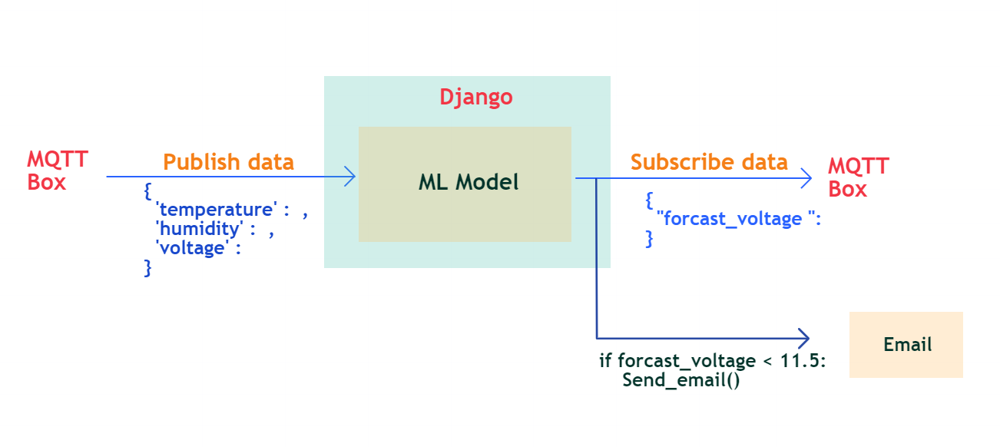

# SolarPanelCleaningMonitor



SolarPanelCleaningMonitor is a Django web application designed for monitoring the cleanliness of solar panels using machine learning predictions and MQTT communication. The application integrates various technologies to provide real-time monitoring and alerting functionalities for maintaining optimal performance of solar panels.

## Features
- **MQTT Integration**: Utilizes MQTT communication protocol for real-time data exchange and prediction dissemination.
- **Machine Learning Prediction**: Implements a pre-trained machine learning model to forecast future voltage based on temperature and humidity readings.
- **Email Alerting**: Sends descriptive email alerts to users when the predicted voltage falls below a threshold, prompting cleaning action.
- **Web Interface**: Provides a user-friendly web interface to visualize predicted voltage, current conditions (temperature, humidity), and cleaning recommendations.
- **Scalability**: Designed with scalability in mind, allowing easy expansion to monitor multiple solar panels or additional environmental factors.
- **Customizable Thresholds**: Offers flexibility to customize voltage thresholds for triggering cleaning alerts based on specific panel requirements.
- **Error Handling**: Implements robust error handling mechanisms to ensure reliability and graceful recovery from potential failures.
- **Documentation**: Includes comprehensive documentation on installation, configuration, and usage to facilitate easy deployment and maintenance.

## Usage
1. **Clone the repository:**
    ```bash
    git clone https://github.com/your-username/SolarPanelCleaningMonitor.git
    ```

2. **Install dependencies:**
    ```bash
    pip install -r requirements.txt
    ```

3. **Configure Settings:**
    - **Email Settings:**
        - Update `EMAIL_HOST_USER` with your sender's email address in `settings.py`.
        - Update `EMAIL_HOST_PASSWORD` with your sender's email password or application password in `settings.py`.
    - **MQTT Settings:**
        - Update `MQTT_BROKER`, `MQTT_PORT`, `MQTT_USERNAME`, `MQTT_PASSWORD`, and `MQTT_SUBSCRIBE_TOPIC` in `settings.py`.


4. **Run the Django development server:**
    ```bash
    python manage.py runserver
    ```

5. **Access the web interface:**
    Open your web browser and go to `http://localhost:8000` to monitor solar panel cleanliness and receive alerts.

## Contributions
Contributions to enhance features, improve documentation, and fix bugs are welcome. Please follow the contribution guidelines outlined in the repository.

## License
This project is licensed under the MIT License. See the `LICENSE` file for details.

## Authors
- [Shashika Udara](https://github.com/code9633) - Initial development
